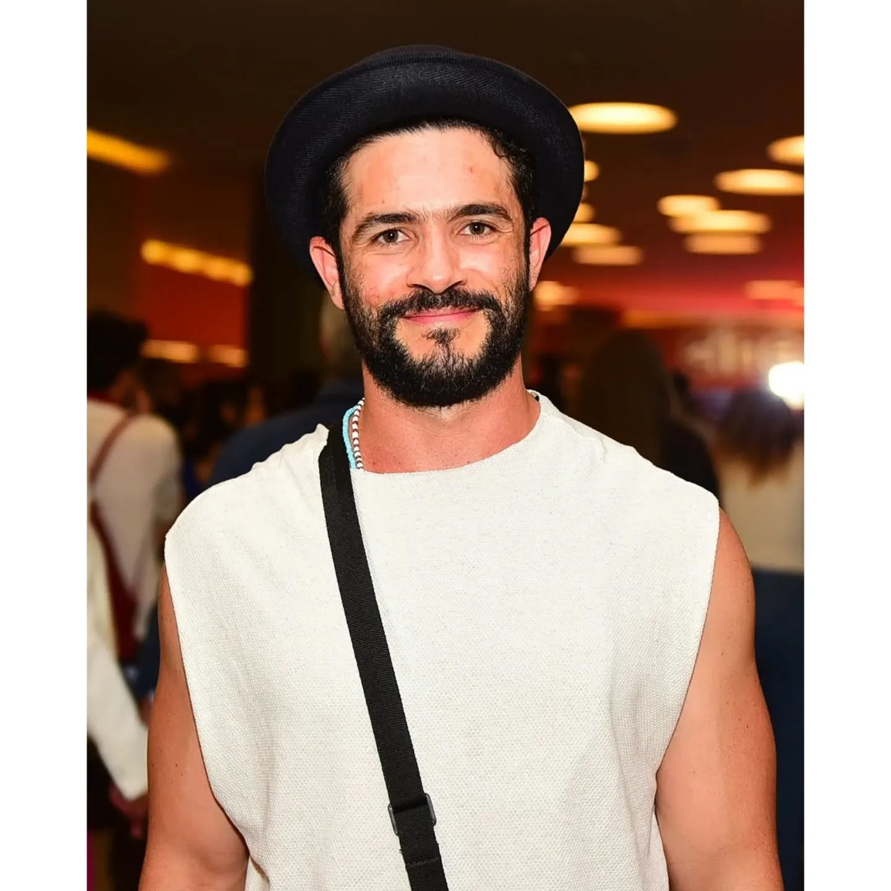

# Vinicius de Oliveira

**Ator Brasileiro**

---

## Sobre

**Nome Completo:** Vinícius Campos de Oliveira  
**Nascimento:** 18 de julho de 1985  
**Local:** Rio de Janeiro, RJ, Brasil  
**Profissão:** Ator  
**Instagram:** [@vinicentral](https://www.instagram.com/vinicentral/)

---

## Biografia

Vinícius de Oliveira é um ator brasileiro nascido e criado no Complexo da Maré, no Rio de Janeiro. Sua história de vida é marcada por uma descoberta cinematográfica que mudaria seu destino para sempre.

Trabalhando como engraxate no Aeroporto Santos Dumont quando tinha apenas 11 anos, Vinícius foi descoberto pelo renomado diretor Walter Salles. Entre mais de 1.500 candidatos, ele foi escolhido para protagonizar o aclamado filme **Central do Brasil** (1998), ao lado da grande atriz Fernanda Montenegro.

Antes de se tornar ator, Vinícius sonhava em ser jogador de futebol e jogava em um time de sua comunidade.

---

## Carreira

### Cinema

**Destaque:** Protagonista do filme **Central do Brasil** (1998), dirigido por Walter Salles, no papel do menino Josué.

#### Premiações do Filme Central do Brasil
- **Urso de Ouro** (Melhor Filme) no 48º Festival de Berlim
- **Globo de Ouro** de Melhor Filme em Língua Estrangeira
- Duas indicações ao **Oscar** em 1999

#### Outros Trabalhos no Cinema
- **Abril Despedaçado** (2001) - Participação especial, direção de Walter Salles
- **Bala Perdida** (2003) - Curta-metragem dirigido por Victor Lopes, vencedor no Festival do Rio BR 2003
- **Linha de Passe** (2008) - De Daniela Thomas e Walter Salles, exibido no Festival de Cannes
- **Assalto ao Banco Central** (2011) - Mais de 1 milhão de espectadores
- **Se Deus Vier que Venha Armado** (2014) - No papel de Damião
- **Boi Neon** (2015/2016) - Filme premiado

### Televisão

- **Alô, Vídeo Escola** (Canal Futura, 1998-2000) - Apresentador
- **Que bicho é esse?** (Canal Futura, 1998-2000) - Apresentador
- **Suave Veneno** (TV Globo, 1999) - Elenco principal
- **Carga Pesada** (TV Globo, 2004 e 2005) - Participações
- **Nosso Querido Trapalhão** (Rede Globo, 2010) - Papel principal como jovem Renato Aragão
- **Magnífica 70** (HBO) - Terceira temporada

### Teatro

- **Jovem Drummond** (2000) - Espetáculo baseado em poesias de Carlos Drummond de Andrade, direção de André Monteiro
- **Eles não usam Black-tie** (2001) - Com Eduardo Moscovis, Sebastião Vasconcelos e Ana Lúcia Torre
- **A geração Trianon** (2004) - Teatro Miguel Falabela

---

## Outros Trabalhos

Em 2007, Vinícius trabalhou como estagiário de assistente de direção no filme "Se nada mais der certo", de José Eduardo Belmonte, demonstrando interesse em outras áreas da produção cinematográfica.

---

## Reconhecimento

Mesmo após mais de 25 anos do lançamento de **Central do Brasil**, Vinícius de Oliveira ainda é reconhecido e lembrado pelo icônico papel de Josué, que marcou o cinema brasileiro e teve repercussão internacional.

---

*"De engraxate a ator: uma história de talento e oportunidade que representa o Brasil."*
